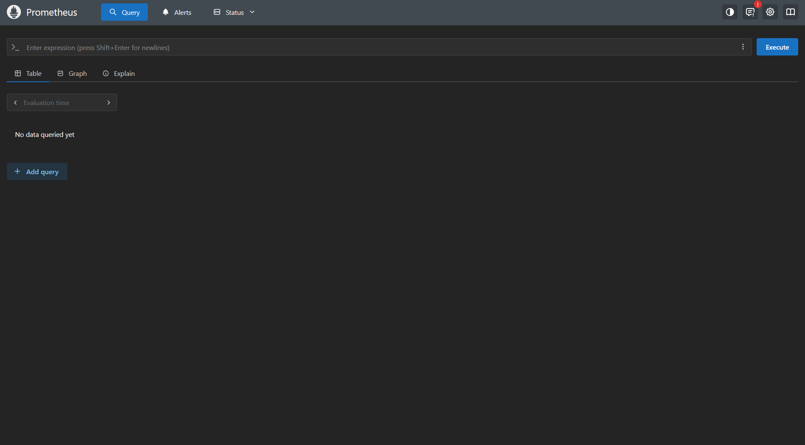
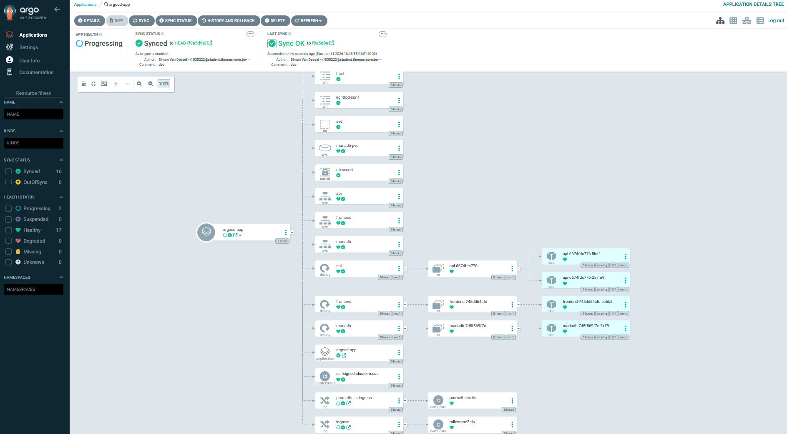

# Simon Van Dessel webstack on a Kubernetes cluster

## Introduction

This documentation provides a comprehensive overview of the Kubernetes-based infrastructure designed for this project. The primary goal of this architecture is to create a robust, scalable, and fully automated environment that bridges the gap between local development and production-grade orchestration. By using modern DevOps principles, this stack ensures that every component is reproducible, documented, and managed through code.

The infrastructure uses a selection of modern tools to handle cluster management, traffic routing, security, and continuous delivery:

* **Kind (Kubernetes in Docker)**: This is the foundation of the setup. It allows us to run a real Kubernetes cluster inside Docker on a local computer, making it easy to build and test our environment without needing a cloud provider.
* **Traefik**: This acts as the gateway for all incoming traffic. It directs web requests to the correct applications inside the cluster and handles load balancing to ensure everything stays responsive.
* **Cert-Manager**: This tool manages security certificates. It automatically handles the creation and renewal of SSL certificates, ensuring that all connections to our services are encrypted and secure (HTTPS).
* **Argo CD**: This is the deployment manager. It uses a "GitOps" approach, which means it constantly checks our code repository and automatically updates the cluster to match our configuration files.
* **lighttpd**: A lightweight, high-performance web server designed for speed-critical environments, used to serve static assets with minimal resource consumption.
* **NodeJS**: The backend runtime environment that executes JavaScript code, handling the core business logic and providing a scalable API for the frontend.
* **MariaDB**: The relational database management system used for persistent data storage, ensuring that all application data is stored securely and remains highly available.
* **Prometheus**: An open-source monitoring and alerting toolkit designed for reliability and scalability, used to collect and store metrics from the cluster and applications.

---

## Quick Start Guide

To set up the infrastructure and deploy the application, follow these steps in order:

1. **Initialize the Kind Cluster**:
   Create the cluster and load the application images:

   ```bash
   kind delete cluster --name svd
   kind create cluster --name svd --config kind-expose.yaml
   kind load docker-image r1035222/ms2_frontend:latest r1035222/ms2_backend:latest --name svd
   ```
2. **Install Infrastructure via Helm**:
   Update repositories and install the ingress controller, cert-manager, monitoring stack, and Argo CD:

   ```bash
   helm repo update

   helm install cert-manager jetstack/cert-manager \
     -n cert-manager --create-namespace \
     --set installCRDs=true

   helm install traefik traefik/traefik \
     -n traefik --create-namespace \
     --set ports.web.nodePort=30090 \
     --set ports.websecure.nodePort=31740 \
     --set service.type=NodePort

   helm install prometheus prometheus-community/kube-prometheus-stack \
     --namespace monitoring --create-namespace \
     --set prometheus.service.type=NodePort \
     --set prometheus

   ```
3. **Apply Application Manifests**:
   Deploy the application components and GitOps configuration:

   ```bash
   kubectl apply -f clusterissuer.yaml
   kubectl apply -f namespace.yaml
   kubectl apply -f backend.yaml
   kubectl apply -f frontend.yaml
   kubectl apply -f database.yaml
   kubectl apply -f ingress.yaml
   kubectl apply -f argo-cd.yaml
   ```
4. **Finalize and Access**:
   Wait for the Argo CD server to be ready and retrieve the initial admin password:

   ```bash
   kubectl -n argocd wait --for=condition=Ready pod -l app.kubernetes.io/name=argocd-server --timeout=120s

   # Retrieve Argo CD password (PowerShell)
   [System.Text.Encoding]::UTF8.GetString([System.Convert]::FromBase64String((kubectl -n argocd get secret argocd-initial-admin-secret -o jsonpath="{.data.password}")))
   ```

   *Prometheus RAM Usage Query:* `100 * (1 - (node_memory_MemAvailable_bytes / node_memory_MemTotal_bytes))`

---

## Accessing the Dashboards

Once the installation is complete, you can access the main application and management tools via the following endpoints:

| Service                    | Access URL                                                                 | Description                         |
| :------------------------- | :------------------------------------------------------------------------- | :---------------------------------- |
| **Main Application** | [https://milestone2.example.com:31740](https://milestone2.example.com:31740/) | Primary project landing page        |
| **Prometheus**       | [https://milestone2.example.com:30900](https://milestone2.example.com:30900)  | Monitoring and metrics dashboard    |
| **Argo CD**          | [https://milestone2.example.com:30890](https://milestone2.example.com:30890)  | GitOps synchronization and delivery |

---

### 📈 Prometheus

Prometheus is the monitoring and alerting toolkit used to collect and store metrics from your applications and infrastructure. It provides a powerful query language (PromQL) to visualize time-series data, helping you monitor the health and performance of your cluster.



### 🐙 Argo CD

Argo CD is the GitOps tool used to maintain the desired state of your applications. It monitors your Git repositories for changes and automatically synchronizes them with the cluster. The dashboard provides a visual representation of application health, resource trees, and synchronization history.



---

## 1. Kind Cluster Configuration (`kind-expose.yaml`)

The foundation of the setup is a Kind cluster that maps specific ports from your local machine into the Kubernetes control plane.

```yaml
kind: Cluster
apiVersion: kind.x-k8s.io/v1alpha4
nodes:
  - role: control-plane
    extraPortMappings:
      - containerPort: 30900 # Prometheus
        hostPort: 30900
      - containerPort: 31740 # HTTPS
        hostPort: 31740
      - containerPort: 30890 # ArgoCD
        hostPort: 30890
  - role: worker
  - role: worker
```

### Line-by-line explanation:

- `kind: Cluster`: Specifies that the resource being defined is a Cluster.
- `apiVersion: kind.x-k8s.io/v1alpha4`: Defines the specific API version for the Kind cluster configuration.
- `nodes:`: Begins the list of nodes that will make up this cluster.
- `- role: control-plane`: Configures the first node to act as the control plane (master).
- `extraPortMappings:`: Starts the list of extra port mappings from the container to the host.
- `- containerPort: 30900`: The port listening inside the container (Prometheus).
- `hostPort: 30900`: The port exposed on the host machine.
- `- containerPort: 31740`: The port listening inside the container (Traefik HTTPS).
- `hostPort: 31740`: The port exposed on the host machine.
- `- containerPort: 30890`: The port listening inside the container (Argo CD).
- `hostPort: 30890`: The port exposed on the host machine.
- `- role: worker`: Adds a worker node to the cluster.
- `- role: worker`: Adds a second worker node.

---

## 2. Namespace Definition (`namespace.yaml`)

Used to create a logical isolation for all our application resources.

```yaml
apiVersion: v1
kind: Namespace
metadata:
  name: svd
```

### Line-by-line explanation:

- `apiVersion: v1`: Uses the core Kubernetes API version.
- `kind: Namespace`: Specifies that the resource type is a Namespace.
- `metadata:`: Section for resource metadata.
- `name: svd`: The name of the namespace. All subsequent resources will created in this namespace.

---

## 3. Database Layer (`database.yaml`)

This file makes the MariaDB database, including its credentials, initialization scripts, and persistent storage.

```yaml
apiVersion: v1
kind: Secret
metadata:
  name: db-secret
  namespace: svd
type: Opaque
stringData:
  DB_HOST: "mariadb"
  DB_USER: "svduser"
  DB_PASSWORD: "svdpass"
  DB_DATABASE: "svddb"
  MYSQL_ROOT_PASSWORD: "svdroot"
  MYSQL_DATABASE: "svddb"
  MYSQL_USER: "svduser"
  MYSQL_PASSWORD: "svdpass"
---
apiVersion: v1
kind: ConfigMap
metadata:
  name: db-init
  namespace: svd
data:
  init.sql: |
    CREATE TABLE IF NOT EXISTS names (name VARCHAR(255));
    INSERT INTO names (name) VALUES ('Simon Van Dessel');
---
apiVersion: v1
kind: PersistentVolumeClaim
metadata:
  name: mariadb-pvc
  namespace: svd
spec:
  accessModes: ["ReadWriteOnce"]
  resources:
    requests:
      storage: 2Gi
---
apiVersion: apps/v1
kind: Deployment
metadata:
  name: mariadb
  namespace: svd
spec:
  replicas: 1
  selector:
    matchLabels:
      app: mariadb
  template:
    metadata:
      labels:
        app: mariadb
    spec:
      containers:
        - name: mariadb
          image: mariadb:10.5
          ports:
            - containerPort: 3306
          envFrom:
            - secretRef:
                name: db-secret
          resources:
            requests:
              memory: "256Mi"
              cpu: "100m"
            limits:
              memory: "512Mi"
              cpu: "500m"
          volumeMounts:
            - name: db-init
              mountPath: /docker-entrypoint-initdb.d
            - name: db-storage
              mountPath: /var/lib/mysql
      volumes:
        - name: db-init
          configMap:
            name: db-init
        - name: db-storage
          persistentVolumeClaim:
            claimName: mariadb-pvc
---
apiVersion: v1
kind: Service
metadata:
  name: mariadb
  namespace: svd
spec:
  selector:
    app: mariadb
  ports:
    - port: 3306
      targetPort: 3306
```

### Detailed Line-by-Line Explanation:

#### 1. Database Secret (`db-secret`)

- `apiVersion: v1`: Uses the base Kubernetes API version.
- `kind: Secret`: Identifies this resource as a Secret for storing sensitive data.
- `metadata:`: Metadata section for the Secret.
- `name: db-secret`: The unique name for this secret.
- `namespace: svd`: Specifies the namespace where this secret resides.
- `type: Opaque`: Indicates the secret contains arbitrary data.
- `stringData:`: Allows defining secret data as plain strings (automatically Base64-encoded).
- `DB_HOST: "mariadb"`: The hostname for the database connection.
- `DB_USER: "svduser"`: The username for the application to access the database.
- `DB_PASSWORD: "svdpass"`: The password for the application user.
- `DB_DATABASE: "svddb"`: The name of the database to connect to.
- `MYSQL_ROOT_PASSWORD: "svdroot"`: The password for the root user of MariaDB.
- `MYSQL_DATABASE: "svddb"`: The name of the database to be created at initialization.
- `MYSQL_USER: "svduser"`: The username to be created at initialization.
- `MYSQL_PASSWORD: "svdpass"`: The password for the created user.

#### 2. Init Script ConfigMap (`db-init`)

- `apiVersion: v1`: Uses the base Kubernetes API version.
- `kind: ConfigMap`: Identifies this resource as a ConfigMap.
- `metadata:`: Metadata section.
- `name: db-init`: The name of this ConfigMap.
- `namespace: svd`: The namespace for this resource.
- `data:`: The data section containing the configuration keys and values.
- `init.sql: |`: The key `init.sql` containing a multi-line string (indicated by `|`).
- `CREATE TABLE IF NOT EXISTS names (name VARCHAR(255));`: SQL command to create the table.
- `INSERT INTO names (name) VALUES ('Simon Van Dessel');`: SQL command to insert initial data.

#### 3. Persistent Storage (`mariadb-pvc`)

- `apiVersion: v1`: Uses the base Kubernetes API version.
- `kind: PersistentVolumeClaim`: Identifies this resource as a request for storage.
- `metadata:`: Metadata section.
- `name: mariadb-pvc`: The name of this claim.
- `namespace: svd`: The namespace for this resource.
- `spec:`: Specification of the desired storage.
- `accessModes: ["ReadWriteOnce"]`: The volume can be mounted as read-write by a single node.
- `resources:`: Resource requirements for the storage.
- `requests:`: The minimum resources required.
- `storage: 2Gi`: Requests 2 Gigabytes of storage.

#### 4. MariaDB Deployment

- `apiVersion: apps/v1`: Uses the apps API version for Deployments.
- `kind: Deployment`: Identifies this resource as a Deployment.
- `metadata:`: Metadata for the Deployment.
- `name: mariadb`: The name of the Deployment.
- `namespace: svd`: The namespace for the Deployment.
- `spec:`: Specification of the Deployment.
- `replicas: 1`: Specifies that 1 pod should be running.
- `selector:`: Defines how the Deployment finds which Pods to manage.
- `matchLabels:`: The labels that must match.
- `app: mariadb`: The label key-value pair to match.
- `template:`: The template used to create new Pods.
- `metadata:`: Metadata for the created Pods.
- `labels:`: Labels attached to the Pods.
- `app: mariadb`: The label identifying the app as mariadb.
- `spec:`: Specification of the Pod contents.
- `containers:`: List of containers in the Pod.
- `- name: mariadb`: The name of the container.
- `image: mariadb:10.5`: The Docker image to use.
- `ports:`: List of ports to expose from the container.
- `- containerPort: 3306`: The internal port number.
- `envFrom:`: Defines references to environment variables.
- `- secretRef:`: References a Secret to populate env vars.
- `name: db-secret`: The name of the Secret to use.
- `resources:`: Compute resource requirements.
- `requests:`: Guaranteed resources.
- `memory: "256Mi"`: Requests 256 MiB of memory.
- `cpu: "100m"`: Requests 100 millicores of CPU.
- `limits:`: Maximum allowed resources.
- `memory: "512Mi"`: Limits memory usage to 512 MiB.
- `cpu: "500m"`: Limits CPU usage to 500 millicores.
- `volumeMounts:`: Filesystems to be mounted into the container.
- `- name: db-init`: The name of the volume to mount.
- `mountPath: /docker-entrypoint-initdb.d`: The path where the volume is mounted.
- `- name: db-storage`: The name of the volume to mount.
- `mountPath: /var/lib/mysql`: The path where the volume is mounted.
- `volumes:`: List of volumes available to the Pod.
- `- name: db-init`: Defines the volume named 'db-init'.
- `configMap:`: The volume is backed by a ConfigMap.
- `name: db-init`: The name of the ConfigMap.
- `- name: db-storage`: Defines the volume named 'db-storage'.
- `persistentVolumeClaim:`: The volume is backed by a PVC.
- `claimName: mariadb-pvc`: The name of the PVC to use.

#### 5. Database Service

- `apiVersion: v1`: Uses the base Kubernetes API version.
- `kind: Service`: Identifies this resource as a Service.
- `metadata:`: Metadata for the Service.
- `name: mariadb`: The name of the Service.
- `namespace: svd`: The namespace for the Service.
- `spec:`: Specification for the Service.
- `selector:`: Defines how to select the Pods to route traffic to.
- `app: mariadb`: Selects Pods with the label 'app: mariadb'.
- `ports:`: List of ports exposed by the Service.
- `- port: 3306`: The port the Service listens on.
- `targetPort: 3306`: The port on the Pod to forward traffic to.

---

## 4. Backend Layer (`backend.yaml`)

Manages the FastAPI application that serves as the bridge between the frontend and the database.

```yaml
apiVersion: apps/v1
kind: Deployment
metadata:
  name: api
  namespace: svd
spec:
  replicas: 2
  selector:
    matchLabels:
      app: api
  template:
    metadata:
      labels:
        app: api
      annotations:
        prometheus.io/scrape: "true"
        prometheus.io/port: "3000"
        prometheus.io/path: "/metrics"
    spec:
      containers:
        - name: api
          image: r1035222/ms2_backend:latest
          ports:
            - containerPort: 3000
          envFrom:
            - secretRef:
                name: db-secret
          resources:
            requests:
              memory: "128Mi"
              cpu: "100m"
            limits:
              memory: "512Mi"
              cpu: "500m"
          livenessProbe:
            httpGet:
              path: /api/name
              port: 3000
            initialDelaySeconds: 10
            periodSeconds: 5
          readinessProbe:
            httpGet:
              path: /api/name
              port: 3000
            initialDelaySeconds: 5
            periodSeconds: 5
---
apiVersion: v1
kind: Service
metadata:
  name: api
  namespace: svd
spec:
  selector:
    app: api
  ports:
    - port: 3000
      targetPort: 3000
```

### Detailed Line-by-Line Explanation:

#### 1. API Deployment

- `apiVersion: apps/v1`: Uses the apps API version.
- `kind: Deployment`: Identifies this as a Deployment.
- `metadata:`: Metadata section.
- `name: api`: Name of the Deployment.
- `namespace: svd`: Namespace for the Deployment.
- `spec:`: Specification of the Deployment.
- `replicas: 2`: Runs two instances for high availability.
- `selector:`: Label selector for managed Pods.
- `matchLabels:`: The labels to match.
- `app: api`: The label key-value pair.
- `template:`: Template for creating Pods.
- `metadata:`: Metadata for the Pods.
- `labels:`: Labels to apply to the Pods.
- `app: api`: The app label.
- `annotations:`: Metadata to configure external tools.
- `prometheus.io/scrape: "true"`: Enables Prometheus scraping.
- `prometheus.io/port: "3000"`: Port for Prometheus to scrape.
- `prometheus.io/path: "/metrics"`: Path for metrics.
- `spec:`: Specification of the Pod contents.
- `containers:`: List of containers.
- `- name: api`: Name of the container.
- `image: r1035222/ms2_backend:latest`: The custom nodejs Docker image.
- `ports:`: List of ports.
- `- containerPort: 3000`: Port the container listens on.
- `envFrom:`: Source of environment variables.
- `- secretRef:`: References a secret.
- `name: db-secret`: The secret containing DB credentials.
- `resources:`: Resource requests and limits.
- `requests:`: Guaranteed resources.
- `memory: "128Mi"`: Requests 128 MiB RAM.
- `cpu: "100m"`: Requests 100m CPU.
- `limits:`: Maximum allowed resources.
- `memory: "512Mi"`: Limits RAM to 512 MiB.
- `cpu: "500m"`: Limits CPU to 500m.
- `livenessProbe:`: Configuration to check if the app is alive.
- `httpGet:`: Performs an HTTP GET request.
- `path: /api/name`: Endpoint to check.
- `port: 3000`: Port to check.
- `initialDelaySeconds: 10`: Wait 10s before first check.
- `periodSeconds: 5`: Check every 5s.
- `readinessProbe:`: Configuration to check if app is ready for traffic.
- `httpGet:`: Performs an HTTP GET request.
- `path: /api/name`: Endpoint to check.
- `port: 3000`: Port to check.
- `initialDelaySeconds: 5`: Wait 5s before first check.
- `periodSeconds: 5`: Check every 5s.

#### 2. API Service

- `apiVersion: v1`: Uses the base API version.
- `kind: Service`: Identifies this as a Service.
- `metadata:`: Metadata section.
- `name: api`: Name of the Service.
- `namespace: svd`: Namespace of the Service.
- `spec:`: Specification of the Service.
- `selector:`: Selects Pods to route to.
- `app: api`: Matches Pods with 'app: api'.
- `ports:`: Port configuration.
- `- port: 3000`: Service port.
- `targetPort: 3000`: Pod port.

---

## 5. Frontend Layer (`frontend.yaml`)

Handles the Lighttpd web server and the static UI.

```yaml
# 3. ConfigMap: lighttpd.conf (already has /api proxy)
apiVersion: v1
kind: ConfigMap
metadata:
  name: lighttpd-conf
  namespace: svd
data:
  lighttpd.conf: |
    server.document-root = "/var/www/html"
    server.port = 80
    mimetype.assign = ( ".html" => "text/html", ".js" => "text/javascript" )
    server.error-handler-404 = "/index.html"
    server.modules += ( "mod_proxy" )
    proxy.server = ( "/api" =>
      ( ( "host" => "api", "port" => 3000 ) )
    )
---
# 4. ConfigMap: real index.html
apiVersion: v1
kind: ConfigMap
metadata:
  name: html
  namespace: svd
data:
  index.html: |-
    <!DOCTYPE html>
    <html lang="en">
      <head>
        <meta charset="UTF-8" />
        <meta name="viewport" content="width=device-width, initial-scale=1.0" />
        <title>Milestone 2</title>
      </head>
      <body>
        <h1><span id="user">Loading...</span> has reached milestone 2!</h1>
        <p>Container ID: <strong id="cid">Loading...</strong></p>

        <script>
          // fetch name
          fetch("/api/name")
            .then(r => r.json())
            .then(d => document.getElementById("user").innerText = d.name)
            .catch(() => document.getElementById("user").innerText = "error");

          // fetch container ID (pod name)
          fetch("/api/container-id")
            .then(r => r.json())
            .then(d => document.getElementById("cid").innerText = d.container_id)
            .catch(() => document.getElementById("cid").innerText = "error");
        </script>
      </body>
        </html>
---
# 8. lighttpd Deployment + Service
apiVersion: apps/v1
kind: Deployment
metadata:
  name: frontend
  namespace: svd
spec:
  replicas: 1
  selector:
    matchLabels:
      app: frontend
  template:
    metadata:
      labels:
        app: frontend
    spec:
      containers:
        - name: frontend
          image: r1035222/ms2_frontend:latest
          ports:
            - containerPort: 80
          resources:
            requests:
              memory: "64Mi"
              cpu: "50m"
            limits:
              memory: "128Mi"
              cpu: "200m"
          volumeMounts:
            - name: conf
              mountPath: /etc/lighttpd/lighttpd.conf
              subPath: lighttpd.conf
            - name: html
              mountPath: /var/www/html
      volumes:
        - name: conf
          configMap:
            name: lighttpd-conf
        - name: html
          configMap:
            name: html
---
apiVersion: v1
kind: Service
metadata:
  name: frontend
  namespace: svd
spec:
  type: ClusterIP
  selector:
    app: frontend
  ports:
    - port: 8080
      targetPort: 80
```

### Detailed Line-by-Line Explanation:

#### 1. Lighttpd Configuration (`lighttpd-conf`)

- `apiVersion: v1`: Uses the base API version.
- `kind: ConfigMap`: Identifies this as a ConfigMap.
- `metadata:`: Metadata section.
- `name: lighttpd-conf`: Name of the ConfigMap.
- `namespace: svd`: Namespace.
- `data:`: Data section.
- `lighttpd.conf: |`: The file content as a multi-line string.
- `server.document-root = "/var/www/html"`: Sets the root directory for serving files.
- `server.port = 80`: Listens on port 80.
- `mimetype.assign = ...`: Maps file extensions to MIME types.
- `server.error-handler-404 = "/index.html"`: Redirects 404 errors to index.html (SPA routing).
- `server.modules += ( "mod_proxy" )`: Enables the proxy module.
- `proxy.server = ( "/api" => ... )`: Configures proxy rules for /api.
- `( ( "host" => "api", "port" => 3000 ) )`: Forwards /api requests to the 'api' host on port 3000.

#### 2. HTML Content (`html`)

- `apiVersion: v1`: Uses the base API version.
- `kind: ConfigMap`: Identifies this as a ConfigMap.
- `metadata:`: Metadata section.
- `name: html`: Name of the ConfigMap.
- `namespace: svd`: Namespace.
- `data:`: Data section.
- `index.html: |-`: The HTML content as a multi-line string.
- `<!DOCTYPE html>...`: Standard HTML5 doctype and structure.
- `<span id="user">...`: Placeholder element for the username.
- `fetch("/api/name")`: JS call to fetch the name from the API.
- `.then(r => r.json())...`: Parses the JSON response.
- `fetch("/api/container-id")`: JS call to fetch the container ID.

#### 3. Frontend Deployment

- `apiVersion: apps/v1`: Apps API version.
- `kind: Deployment`: Identifies as a Deployment.
- `metadata:`: Metadata section.
- `name: frontend`: Deployment name.
- `namespace: svd`: Namespace.
- `spec:`: Specification.
- `replicas: 1`: Runs 1 instance.
- `selector:`: Pod selector.
- `matchLabels:`: Labels to match.
- `app: frontend`: The label.
- `template:`: Pod template.
- `metadata:`: Pod metadata.
- `labels:`: Pod labels.
- `app: frontend`: The label.
- `spec:`: Pod specification.
- `containers:`: Containers list.
- `- name: frontend`: Container name.
- `image: r1035222/ms2_frontend:latest`: The Docker image.
- `ports:`: Exposed ports.
- `- containerPort: 80`: Port 80.
- `resources:`: Resource limits.
- `requests:`: Min resources (64Mi RAM, 50m CPU).
- `limits:`: Max resources (128Mi RAM, 200m CPU).
- `volumeMounts:`: Volume mounts.
- `- name: conf`: Mounts 'conf' volume.
- `mountPath: /etc/lighttpd/lighttpd.conf`: Destination path.
- `subPath: lighttpd.conf`: Mounts only the specific file.
- `- name: html`: Mounts 'html' volume.
- `mountPath: /var/www/html`: Destination path.
- `volumes:`: Defined volumes.
- `- name: conf`: Volume named 'conf'.
- `configMap:`: Backed by ConfigMap.
- `name: lighttpd-conf`: ConfigMap name.
- `- name: html`: Volume named 'html'.
- `configMap:`: Backed by ConfigMap.
- `name: html`: ConfigMap name.

#### 4. Frontend Service

- `apiVersion: v1`: Base API version.
- `kind: Service`: Identifies as a Service.
- `metadata:`: Metadata section.
- `name: frontend`: Service name.
- `namespace: svd`: Namespace.
- `spec:`: Specification.
- `type: ClusterIP`: Internal-only service.
- `selector:`: Pod selector.
- `app: frontend`: Matches frontend pods.
- `ports:`: Port config.
- `- port: 8080`: Service port.
- `targetPort: 80`: Target pod port.

---

## 6. Ingress & TLS (`ingress.yaml`)

Defines how external traffic reaches the frontend and how HTTPS is handled.

```yaml
apiVersion: networking.k8s.io/v1
kind: Ingress
metadata:
  name: ingress
  namespace: svd
  annotations:
    cert-manager.io/cluster-issuer: selfsigned-cluster-issuer
spec:
  ingressClassName: traefik
  tls:
    - hosts:
        - milestone2.example.com
      secretName: milestone2-tls
  rules:
    - host: milestone2.example.com
      http:
        paths:
          - path: /
            pathType: Prefix
            backend:
              service:
                name: frontend
                port:
                  number: 8080
```

### Detailed Line-by-Line Explanation:

#### 1. Ingress Metadata

- `apiVersion: networking.k8s.io/v1`: Uses the networking API version 1.
- `kind: Ingress`: Identifies this resource as an Ingress.
- `metadata:`: Metadata section.
- `name: ingress`: Name of the Ingress.
- `namespace: svd`: Namespace.
- `annotations:`: Annotations for the Ingress controller/Cert-Manager.
- `cert-manager.io/cluster-issuer: selfsigned-cluster-issuer`: Tells Cert-Manager which issuer to use.

#### 2. Ingress Spec

- `spec:`: Specification of the Ingress.
- `ingressClassName: traefik`: Specifies Traefik as the Ingress controller.
- `tls:`: TLS (HTTPS) configuration.
- `- hosts:`: List of hosts to secure.
- `- milestone2.example.com`: The domain name.
- `secretName: milestone2-tls`: The Secret where certs will be stored.
- `rules:`: Routing rules.
- `- host: milestone2.example.com`: Rule applies to this host.
- `http:`: HTTP routing rules.
- `paths:`: List of paths.
- `- path: /`: Matches the root path.
- `pathType: Prefix`: Matches based on path prefix.
- `backend:`: Backend to route to.
- `service:`: Service configuration.
- `name: frontend`: Name of the target Service.
- `port:`: Port configuration.
- `number: 8080`: Target port on the Service.

---

## 7. GitOps with Argo CD (`argo-cd.yaml`)

Ensures that the state of your cluster matches the state of your GitHub repository.

```yaml
apiVersion: argoproj.io/v1alpha1
kind: Application
metadata:
  name: argocd-app
  namespace: argocd
spec:
  project: default
  source:
    repoURL: "https://github.com/simon-vd/AgroCD.git"
    targetRevision: HEAD
    path: .
  destination:
    server: "https://kubernetes.default.svc"
    namespace: svd
  syncPolicy:
    automated:
      prune: true
      selfHeal: true
```

### Detailed Line-by-Line Explanation:

#### 1. Application Metadata

- `apiVersion: argoproj.io/v1alpha1`: Uses the Argo CD API version.
- `kind: Application`: Identifies this as an Argo CD Application.
- `metadata:`: Metadata section.
- `name: argocd-app`: Name of the Application.
- `namespace: argocd`: Namespace (Argo CD lives here).

#### 2. Synchronization Spec

- `spec:`: Specification.
- `project: default`: Belongs to the default Argo CD project.
- `source:`: Source of the manifest files.
- `repoURL: "https://github.com/simon-vd/AgroCD.git"`: The git repository URL.
- `targetRevision: HEAD`: Track the HEAD (latest commit).
- `path: .`: Search for manifests in the root directory.
- `destination:`: Deployment destination.
- `server: "https://kubernetes.default.svc"`: Deploys to the local cluster.
- `namespace: svd`: Deploys resources into the 'svd' namespace.
- `syncPolicy:`: Synchronization settings.
- `automated:`: Automation settings.
- `prune: true`: Delete resources that are removed from git.
- `selfHeal: true`: Revert manual changes to match git state.

---

## Conclusion

This architecture provides a scalable, secure, and automated environment. By decoupling configuration (ConfigMaps/Secrets) from code (Docker images) and using GitOps (Argo CD), you ensure that your deployment is both professional and easy to maintain.

Key takeaways from this setup:

1. **Security First**: Sensitive data is managed via Secrets, and external traffic is secured with TLS certificates managed by Cert-Manager.
2. **Scalability**: The Backend layer is configured with multiple replicas, which Kubernetes automatically balances across multiple worker nodes.
3. **Modern Networking**: By moving from NodePort to a structured Ingress (Traefik), we allow for domain-based routing and a cleaner external interface.
4. **Automation (GitOps)**: Using Argo CD means your cluster's "live" state is always synchronized with your GitHub repository, providing a clear history of changes and preventing "configuration drift."

This setup serves as a robust foundation for any cloud-native application, demonstrating a high level of technical maturity in Kubernetes management.

> **Screenshot placeholders**:
> ``
> ``
> ``

---

*End of Documentation*
